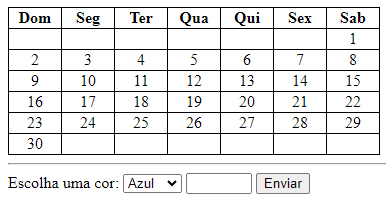
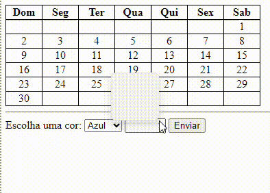

# Calendario

<h3>Repositório criado para a disciplina de Linguagem de Programação I para realização da atividade de criação de calendário iterativo.</h3>

# Índice
* [Introducção](#introduc%C3%A7%C3%A3o)
* [Descrição](#descri%C3%A7%C3%A3o)  
* [Funcionalidades](#funcionalidades)  
* [Tecnologias Utilizadas](#tecnologias-utilizadas) 
* [Autor](https://github.com/miguelitto16/Calendario#autor)  

## Introdução
Este projeto é um Calendário interativo que permite que o usuário selecione um dia do mês e uma cor

## Descrição
Quando o usuário clica em "Aplicar", o dia selecionado na tabela do calendário é colorido com a cor escolhida.

## Funcionalidades
`Calendário Interativo`
* O calendário exibe um mês específico com os dias da semana (Domingo a Sábado) e números de dias.

`Seleção de Cor`
* Pode escolher uma cor a partir de uma lista para aplicar ao dia selecionado.

`Coloração de Dia`
* Ao clicar no botão "Enviar", o dia selecionado na tabela do calendário é colorido com a cor escolhida pelo usuário.

 

### Tecnologias utilizadas

* HTML5
* CSS
* Github
* Visual Studio Code

## Autor
* [Miguel](https://github.com/miguelitto16)
